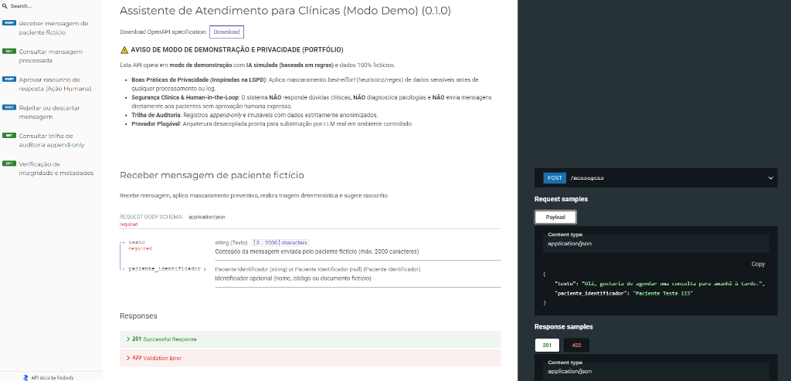
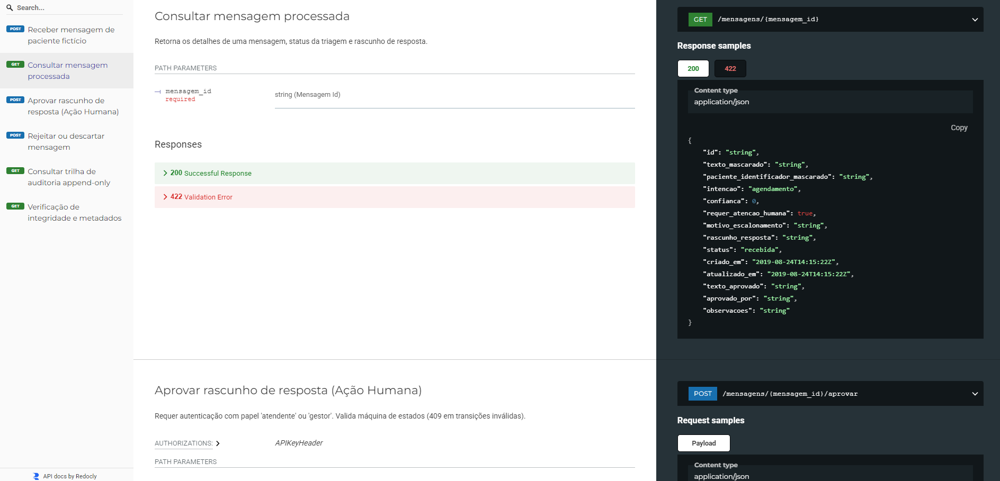
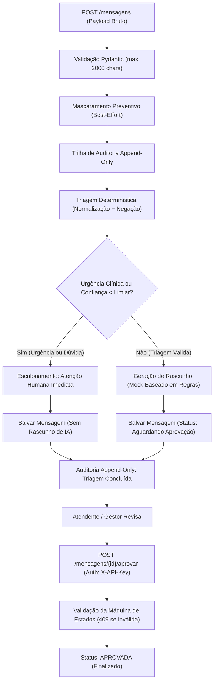

# Assistente de Atendimento para Clínicas (Modo Demo)

[](https://github.com/leomarquetti/assistente-clinica/actions/workflows/ci.yml)
[](https://www.python.org/)
[](https://fastapi.tiangolo.com/)
[](https://docs.pydantic.dev/)
[](https://github.com/astral-sh/ruff)
[](https://mypy-lang.org/)
[](LICENSE)

<p align="center">
  
</p>

> [!WARNING]
> ### ⚠️ AVISO DE MODO DE DEMONSTRAÇÃO E PORTFÓLIO
> Esta aplicação é um **miniprojeto de portfólio que demonstra como estruturo uma API com privacidade e revisão humana desde o desenho**, operando com dados fictícios e clínica fictícia sob **boas práticas de privacidade inspiradas na LGPD**.
>
> **Declaração Fundamental**:
> > **"IA simulada; provider real plugável."**
>
> **O sistema NUNCA responde a dúvidas clínicas, NÃO diagnostica patologias e NÃO envia mensagens a pacientes sem aprovação humana expressa.** O provedor atual de IA é um **mock baseado em regras determinísticas**.
> O mascaramento de dados pessoais é assumidamente **best-effort** (heurístico/regex com validação matemática de documentos).

---

## ⚡ Como Rodar em 2 Minutos (Sem Instalar Python nem Dependências — Requer Docker)

Para testar o projeto imediatamente sem precisar instalar Python, bibliotecas ou configurar ambientes virtuais:

### Opção 1: Via Docker Compose (Requer Docker)
```bash
docker compose up
```
A API iniciará em contêiner com usuário não-root (`appuser`) e persistência em SQLite:
- 📖 **Documentação Interativa (Swagger)**: [http://localhost:8000/docs](http://localhost:8000/docs)
- 📚 **Documentação Estruturada (Redoc)**: [http://localhost:8000/redoc](http://localhost:8000/redoc)

### Opção 2: Via `uv` (Ambiente Local)
```bash
uv run uvicorn app.main:app --port 8000
```

---

## ⏱️ Entenda o Fluxo do Projeto em 2 Minutos

O ciclo operacional completo é estruturado em 4 etapas objetivas:

### 1️⃣ Enviar Mensagem do Paciente (`POST /mensagens`)
O paciente fictício envia uma mensagem contendo dados de identificação e pedido de consulta. O sistema higieniza os dados em tempo real, executa triagem determinística e sugere um rascunho:
```bash
curl -X POST "http://localhost:8000/mensagens" \
  -H "Content-Type: application/json" \
  -d '{
    "texto": "Olá, me chamo Ana Souza Teste, CPF 52998224725 e whats 11987654321. Gostaria de agendar cardiologista para quinta.",
    "paciente_identificador": "P-1024"
  }'
```
> **Nota sobre os dados**: O CPF `52998224725` é o exemplo clássico de teste com dígitos verificadores matematicamente válidos, e o nome é puramente fictício.  
> **Resultado**: O texto é mascarado para `[NOME MASCARADO]`, `[CPF MASCARADO]` e `[TELEFONE MASCARADO]`. A intenção detectada é `agendamento` e o status fica `aguardando_aprovacao`.

### 2️⃣ Consultar Rascunho Sugerido (`GET /mensagens/{id}`)
A equipe de atendimento autentica-se com chave de atendente para consultar o rascunho gerado pelo mock baseado em regras. O identificador `{id}` é um UUIDv4 aleatório (não sequencial) para impedir ataques de enumeração:
```bash
curl "http://localhost:8000/mensagens/<ID_DA_MENSAGEM>" \
  -H "X-API-Key: demo-atendente-key"
```

<p align="center">
  
</p>

### 3️⃣ Aprovação Humana Obrigatória (`POST /mensagens/{id}/aprovar`)
Nenhuma resposta vai ao paciente sem aprovação humana (*human-in-the-loop*). O atendente autentica com sua chave e aprova (ou edita) o rascunho:
```bash
curl -X POST "http://localhost:8000/mensagens/<ID_DA_MENSAGEM>/aprovar" \
  -H "Content-Type: application/json" \
  -H "X-API-Key: demo-atendente-key" \
  -d '{
    "aprovado_por": "atendente_mariana",
    "observacoes": "Confirmado horario turno da manha."
  }'
```
> **Resultado**: A mensagem atinge o estado terminal `aprovada`. Novas tentativas de alteração disparam **HTTP 409 Conflict** pela máquina de estados.

### 4️⃣ Auditoria Append-Only (`GET /auditoria`)
O gestor da clínica consulta a trilha cronológica *append-only*. Todos os eventos (`MENSAGEM_RECEBIDA`, `TRIAGEM_CONCLUIDA`, `MENSAGEM_APROVADA`) constam registrados sem vazamento de dados:
```bash
curl "http://localhost:8000/auditoria" \
  -H "X-API-Key: demo-gestor-key"
```

> [!NOTE]
> **Sobre as chaves de demonstração**: As chaves `demo-atendente-key` e `demo-gestor-key` são estáticas para testes e configuráveis via variáveis de ambiente (`API_KEY_ATENDENTE` e `API_KEY_GESTOR`). O validador do Pydantic em `app/config.py` rejeita explicitamente o uso dessas chaves padrão se `APP_MODE` não for `demo`.

---

## 1. Escopo: O Que o Sistema Faz vs. O Que Não Faz

| O Sistema Faz | O Sistema Não Faz |
| :--- | :--- |
| Recebe mensagens de pacientes fictícios via API REST | Responder dúvidas clínicas ou terapêuticas |
| Mascara preventivamente dados sensíveis (CPF, telefone, email, CEP, RG, data, nomes) | Sugerir diagnósticos médicos ou dosagens de remédios |
| Triagem determinística de sintomas e urgências com normalização e análise de negação | Rebaixar urgência médica detectada em qualquer hipótese |
| Classifica intenções administrativas (`agendamento`, `remarcacao`, etc.) | Enviar mensagens automaticamente sem aprovação humana |
| Sugere rascunho de resposta administrativa para a equipe aprovar | Persistir dados de pacientes em texto claro |
| Registra histórico em trilha de auditoria *append-only* | Operar em modo de produção real com pacientes reais |

---

## 2. Arquitetura e Fluxo do Pipeline

O princípio de design central estabelece que **nenhum texto chega ao provedor de IA ou ao log sem passar previamente pelo mascaramento de privacidade**, e a substituição do mock pelo modelo real ocorre exclusivamente por variável de ambiente, sem alterar uma única linha da lógica de negócio.



---

## 3. Endpoints da API & Controle de Acesso

Na documentação do **Redoc** e **Swagger**, os endpoints protegidos exibem a seção de **Authorizations** com suporte à chave de cabeçalho `X-API-Key`:

| Método | Endpoint | Controle de Acesso | Descrição |
| :--- | :--- | :--- | :--- |
| `POST` | `/mensagens` | Público (Rate Limited) | Recebe mensagem, mascara PII, executa triagem e devolve rascunho |
| `GET` | `/mensagens/{id}` | 🔒 `atendente` / `gestor` | Consulta os detalhes de uma mensagem processada (UUIDv4 anti-enumeração) |
| `POST` | `/mensagens/{id}/aprovar` | 🔒 `atendente` / `gestor` | Aprova ou edita o rascunho sugerido (valida máquina de estados) |
| `POST` | `/mensagens/{id}/rejeitar` | 🔒 `atendente` / `gestor` | Rejeita ou descarta uma mensagem |
| `GET` | `/auditoria` | 🔒 `gestor` (exclusivo) | Lista registros da trilha de auditoria append-only |
| `GET` | `/saude` | Público | Retorna integridade da API, modo demo e provedor ativo |

---

## 4. Stack Tecnológica

| Camada | Tecnologia | Detalhes |
| :--- | :--- | :--- |
| **Linguagem / API** | Python 3.12+, FastAPI, Pydantic v2, Uvicorn | Tipagem estrita com schemas explícitos |
| **Persistência (Demo)** | Memória (`memory`) ou SQLite (`sqlite`) | Driver-based e thread-safe com Lock assíncrono |
| **Persistência (Fase Real)** | PostgreSQL (Supabase) + pgvector | Planejado para busca semântica em base administrativa |
| **Rate Limiting** | SlowAPI | Proteção contra abusos e DoS |
| **Testes** | Pytest, Pytest-Asyncio, HTTPX (`TestClient`) | Suite com 41 testes e verificação de não-vazamento |
| **Qualidade de Código** | Ruff (lint e format), Mypy (`strict=true`) | Padrões rigorosos em todo o código (2 exceções de libs documentadas no `main.py`) |
| **Segurança** | Gitleaks (CI) e Mascaramento Best-Effort | Auditoria append-only e exclusão de `.env` |
| **Container** | Docker multi-stage com usuário não-root | `python:3.12.9-slim-bookworm` e Docker Compose |
| **CI / CD** | GitHub Actions | Lint, formatação, types, testes e secrets em cada push |

---

## 5. Testes Automatizados e Qualidade

O projeto conta com suíte automatizada de 41 testes unitários e de integração, incluindo um teste dedicado à prevenção de vazamento de dados (`tests/test_leak_prevention.py`):

```bash
# Executar a suite completa com pytest
pytest -v

# Executar com relatório de cobertura
pytest --cov=app tests/

# Checagem de linter e formatação (Ruff)
ruff check .
ruff format --check .

# Verificação estrita de tipagem (Mypy)
mypy app tests
```

---

## 6. Roadmap de Evolução

- [x] **Fase 1 (Demo Portfólio)**: Triagem determinística, mascaramento *best-effort*, máquina de estados (409 Conflict), autenticação por papéis (atendente/gestor), log *append-only* e suite de testes.
- [x] **Fase 2 (Infraestrutura Segura)**: Driver SQLite persistente, Dockerfile não-root com versão do Python fixada (`3.12.9-slim`), Docker Compose e GitHub Actions com Gitleaks.
- [ ] **Fase 3 (Base Vetorial)**: Ingestão de base de conhecimento administrativa (procedimentos, preparo de exames, convênios) com PostgreSQL + `pgvector` para busca semântica em normas da clínica.
- [ ] **Fase 4 (LLM Real Controlado)**: Conexão via `app/providers/llm_real.py` com chaves armazenadas em Secret Manager no servidor e teto de gastos rígido.

---

## 7. Limitações Conhecidas

Assumir as fronteiras do projeto demonstra maturidade técnica. Por se tratar de um miniprojeto demonstrativo de portfólio, destacam-se as seguintes limitações de escopo:

1. **Mascaramento de nomes heurístico**: A detecção baseada em expressões regulares cobre padrões de autoapresentação (ex.: *"me chamo..."*, *"sou o/a..."*, *"meu nome é..."*). Não substitui um modelo dedicado de Named Entity Recognition (NER) para nomes citados no meio de frases sem contexto introdutório.
2. **Lista de urgência reduzida e não validada clinicamente**: As palavras-chave de triagem (ex.: *"dor no peito"*, *"falta de ar"*, *"desmaio"*) servem para demonstrar arquiteturalmente o padrão de escalonamento determinístico imediato, não tendo sido validadas por protocolo médico (como Protocolo de Manchester).
3. **Tratamento de negação heurístico**: A busca por marcadores de negação nos 40 caracteres anteriores analisa sentenças diretas (ex.: *"não sinto dor no peito"*). A decisão arquitetural foi pelo viés conservador: havendo ambiguidade ou múltiplos sintomas afirmativos no mesmo texto, o sistema opta sempre pela segurança do paciente e escalona para atenção humana.
4. **Autenticação simplificada por papéis**: As chaves de API (`X-API-Key`) são estáticas por papel (`atendente` e `gestor`) para fins didáticos, sem cadastro, rotação ou gestão individualizada de identidades de usuários.

---

## 8. Licença
Distribuído sob a licença MIT. Consulte `LICENSE` para mais detalhes.
